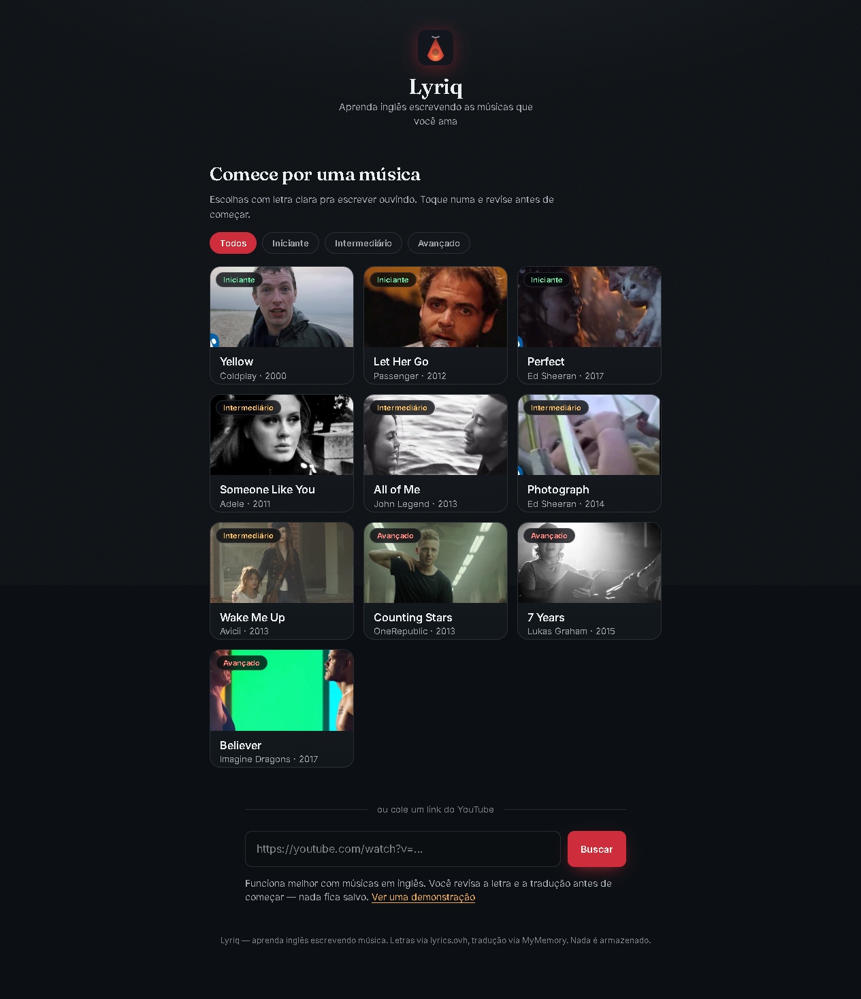
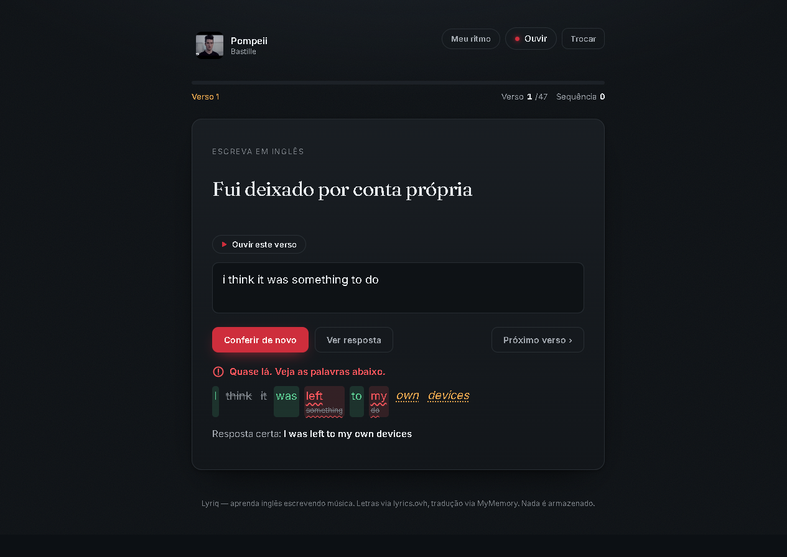

# Lyriq

Aprenda inglês escrevendo as músicas que você ama. Escolha uma música do catálogo
ou cole um link do YouTube, e o app te desafia a digitar a letra em inglês, com
correção **palavra por palavra** — enquanto a letra sincronizada acompanha o vídeo.

**Demo ao vivo:** https://lyriq-learn.vercel.app




## Como funciona

1. Escolha uma das 10 músicas do catálogo, filtrando por nível (iniciante,
   intermediário, avançado), ou cole qualquer URL do YouTube.
2. O app resolve artista/música pelo oEmbed do YouTube, busca a letra e a tradução.
3. Você revisa e edita a letra e a tradução antes de começar — nada é armazenado.
4. Escolha como quer treinar — as três escolhas ficam salvas para a próxima vez:
   - **Modo** — *tradução* (a dica aparece no seu idioma e você escreve o verso em
     inglês) ou *ditado* (ouça e escreva de ouvido, sem tradução).
   - **Tamanho do trecho** — uma frase por vez, ou um parágrafo inteiro. A divisão
     segue os intervalos de tempo da própria música.
   - **Ritmo** — *meu ritmo* (você decide quando ouvir e quando escrever) ou
     *acompanhar a música* (cada trecho toca sozinho e pausa no fim, esperando você
     escrever).
5. Cada tentativa é corrigida palavra por palavra (acertou / errou / faltou /
   sobrou), com sequência de acertos, precisão e um resumo no fim.

A correção usa um alinhamento por LCS (maior subsequência comum) para casar as
palavras digitadas com as esperadas, então ela entende inserções, omissões e
trocas — não é uma comparação posição a posição.

## Karaokê sincronizado

O player usa a YouTube IFrame API (em vez de um iframe simples) para saber o tempo
de reprodução, e busca a letra com marcação de tempo no LRCLIB. O verso atual fica
destacado e acompanha o vídeo, dá para clicar num verso para pular até ele, e os
parágrafos são inferidos pelos intervalos de tempo.

Como o LRC é cronometrado pela versão de estúdio, clipes com introdução mais longa
saem adiantados — por isso existe um ajuste manual de sincronia (±0,5s por toque,
até 15s). Música sem letra sincronizada continua funcionando: o vídeo toca normal e
o treino segue no seu ritmo.

## O que fica salvo

Nada sai do navegador. Não há conta nem back-end próprio.

- **Progresso por música** (melhor precisão, melhor sequência, número de sessões),
  em `localStorage` sob `lyriq.progress.v1`, com o id do vídeo como chave.
- **Preferências de treino** (modo, tamanho do trecho e ritmo), sob `lyriq.prefs.v1`.
  As três voltam como você deixou; um valor antigo ou editado à mão cai no padrão
  em vez de quebrar a tela.

O catálogo guarda **só metadados** — artista, título e id do vídeo. As letras são
buscadas na hora e nunca ficam no repositório.

## Stack

- **React 18 + TypeScript + Vite** no front-end
- **Framer Motion** para as transições
- **YouTube IFrame API** para o player (necessária para conhecer o tempo)
- **Funções serverless na Vercel** para evitar CORS e manter tudo sem chave de API
- Sem back-end próprio; letra via [lyrics.ovh](https://lyrics.ovh), letra
  sincronizada via [LRCLIB](https://lrclib.net) e tradução via
  [MyMemory](https://mymemory.translated.net)

## Rodando localmente

```bash
npm install
npm run dev          # front-end (as funções /api precisam da Vercel)
# ou, para rodar front + funções juntos:
vercel dev
```

As funções em `api/` **não rodam** no `vite dev`. Prefira `vercel dev` quando for
mexer em busca, letra sincronizada ou na divisão por parágrafo — essa última
depende de `api/song.js`.

Build de produção:

```bash
npm run build        # tsc -b && vite build
```

## Estrutura

```
api/
  song.js         busca a letra; preserva linhas em branco como separador de parágrafo
  synced.js       proxy do LRCLIB (get + search)
  translate.js    tradução
src/
  screens/        Setup (catálogo, busca, revisão, preferências) e Trainer (treino)
  components/     MediaPanel (player + letra + sincronia), SyncedLyrics, Feedback, Results
  hooks/          useTrainer (estado do treino), useYouTubePlayer (IFrame API)
  lib/
    diff.ts       correção palavra por palavra (LCS)
    lrc.ts        parse de LRC, linha ativa, parágrafos por gap, início/fim do trecho
    lyrics.ts     blocos, achatamento, limpeza de marcações
    prefs.ts      preferências de treino
    progress.ts   progresso local
    api.ts        chamadas às funções
  data/           catalog.ts (metadados das 10 músicas), demo.ts
ESTADO.md         estado do projeto e o que falta
PRODUCT.md        decisões de produto
DESIGN.md         sistema visual
```

## Observações

As fontes gratuitas de letra e tradução são ótimas para um projeto assim, mas não
cobrem toda música e a tradução automática às vezes é literal — por isso a tela de
revisão é parte central do fluxo. As letras pertencem aos seus respectivos autores;
o Lyriq apenas as exibe para prática pessoal e não armazena nada.

## Licença

MIT
